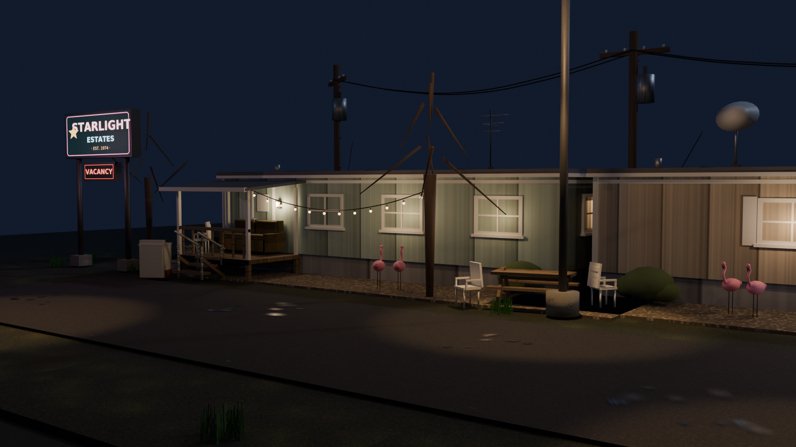

# WORLD KIT — STARLIGHT ESTATES

**Input concept:** *1995 trailer park at night* — one strongly defined visual
environment, developed as a modular, reusable world-building kit rather than a
single fixed scene.

**Starlight Estates, est. 1974.** A single-wide mobile-home park after dark:
sodium streetlamps, tungsten windows, a buzzing pylon sign with one vacancy,
chain-link runs, flamingos, a rusted sedan under a carport, and wires sagging
between telephone poles. The kit builds this park — and any park like it.



---

## 1. Deliverables map

| Deliverable | Path |
|---|---|
| Asset library `.blend` (40 assets, collections, packed textures) | `WorldKit/blend/WK_Starlight_Library.blend` |
| Material library `.blend` + swatch sheet | `WorldKit/blend/WK_Starlight_Materials.blend`, `WorldKit/catalog/material_swatches.png` |
| Individual GLBs (one per asset, embedded textures, `KHR_lights_punctual`) | `WorldKit/glb/WK_*.glb` (40 files) |
| Thumbnail catalog | `WorldKit/catalog/catalog.html`, `contact_sheet.png`, `thumbs/` |
| Assembled showcase scene | `WorldKit/blend/WK_Starlight_Showcase.blend` (scene `SHOWCASE`) |
| 360° environment render | `WorldKit/renders/pano_360.png` (2048×1024 equirect) |
| Camera walkthrough | `WorldKit/video/walkthrough.mp4` (+ `walkthrough_preview.gif`) |
| Stills | `WorldKit/renders/showcase_hero.png`, `showcase_street.png` |
| Procedural source textures | `WorldKit/tex/*.png` (19 files) |
| Build scripts (reproducible pipeline) | `tools/*.py` |

---

## 2. Art direction — one coherent kit

**Design language.** Chunky low-poly hard-surface with softened edges (2-segment
bevels on hero pieces), flat-color + small procedural texture detail, night-first
lighting: every asset is authored to read under moonlight + sodium + tungsten.

**Shared rules across all 40 assets**

- **Scale:** metric, 1 unit = 1 m. Trailers 10–12 m, doors 0.94×2.04 m,
  fence runs 4 m, road 8×6 m, wires span 12 m / 6 m.
- **Materials:** one family of ~40 Principled materials shared by every asset
  (see §5). No per-asset snowflake shaders.
- **Surface treatment:** painted-metal siding grooves, galvanized posts,
  weathered plank wood, rust blotches, worn asphalt — all from 19 small
  procedural textures, packed in the `.blend`, embedded in every GLB.
- **Polygon philosophy:** quads, 12–24-gon round profiles, curves only where
  silhouette matters (wires, string lights, flamingo necks). Whole kit ≈ 16 k
  tris; heaviest single asset (flamingo pair) ≈ 2.6 k.
- **Color logic:** desaturated 90s pastels (mint / sand / dusty-blue siding)
  that sit cleanly under orange sodium and warm window light; night sky
  `#0a0e20`-ish blues; rust + chain-link grays as neutrals.

**Modularity proof.** Openings are standardized: trailers and the shed carry
dark recesses sized exactly for `WK_DOOR_TrailerDoor` and `WK_WND_*`, so doors
and lit/dark windows swap freely. Pads tile edge-to-edge (8 m gravel, 4 m
concrete, 6 m grass), fence runs chain at 4 m, wires span pole-to-pole at
12 m. The showcase scene instances **only** kit pieces (plus one neutral dirt
disc under the horizon and scene lights/cameras).

---

## 3. Naming convention

```
WK_<CATEGORY>_<Name>                 asset anchor (Empty) + sub-collection
WK_<CATEGORY>_<Name>_P##             mesh part (data-block shares the name)
WK_<CATEGORY>_<Name>_L##             light (exports as KHR_lights_punctual)
M_<Family><Variant>                  material, e.g. M_Siding_Mint, M_Curtain
SHOW_<Asset>                         showcase collection-instance
CAM_Hero / CAM_Street / CAM_Pano / CAM_Walk
```

| Category | Collection | Contents |
|---|---|---|
| `ARCH` | `WK_ARCH` | Trailer_A/B shells, porch add-on, shed, carport |
| `STR` | `WK_STR` | Steps, cinder pier, TV antenna, satellite dish |
| `DOOR` / `WND` | `WK_DOOR` / `WK_WND` | Trailer door, lit + dark windows |
| `WALL` | `WK_WALL` | 4 m chain-link run, gate |
| `FLR` / `TER` | `WK_FLR` / `WK_TER` | Gravel + concrete pads, road, grass patch |
| `FUR` | `WK_FUR` | Lawn chair, picnic table, porch couch |
| `PRP` | `WK_PRP` | Trash can, tires, flamingos, washer, vending, pole, wires, dumpster |
| `LGT` | `WK_LGT` | Streetlamp, porch light, string lights (real lights incl.) |
| `SGN` | `WK_SGN` | Pylon sign (hero), trespass board |
| `VEG` | `WK_VEG` | Scrub bush, dead tree, grass tuft |
| `DCL` | `WK_DCL` | Oil stain, puddle (alpha ground decals) |
| `HERO` | `WK_HERO` | 1986 rusted sedan |

---

## 4. Origin & placement convention

- **Default:** anchor at the **ground-projected base center**, `z = 0` at the
  underside/contact plane. Drop into any engine at terrain height.
- **Fronts face +Y** (Blender) → +Z (glTF/FBX front after Y-up export):
  trailers, shed, porch (railing side), door, windows, vending, pylon.
- **Surfaces:** pads/road/grass/decal tops sit exactly at local `z = 0`
  (bodies extend downward), so pieces stack without z-fighting.
- **Spans:** `WireSpan` endpoints at `(±6, 0, 0)`, sag −0.9 m;
  `StringLights` endpoints at `(±3, 0, 0)`, sag −0.55 m, bulbs included.
- **Mounts:** `PorchLight` origin is the wall-mount point; `Dish`/`Antenna`
  origins are the roof-mount base; gable windows rotate ±90° onto end walls.

---

## 5. Material families

All Principled, all glTF-clean (BaseColor ± texture, Emission, MASK/BLEND
alpha where needed, `doubleSided` only on mesh/grille/decals).

| Family | Materials | Notes |
|---|---|---|
| Painted siding | `M_Siding_Mint/Sand/Blue`, `M_Skirting` | one groove texture × tints |
| Paint & trim | `M_Trim`, `M_Roof`, `M_White`, `M_Black` | |
| Metals | `M_Galv`, `M_Chrome`, `M_DarkMetal`, `M_Rust` | rust is procedural blotch |
| Woods | `M_Wood`, `M_PoleWood` | weathered planks / creosote |
| Ground | `M_Asphalt`, `M_Road`, `M_Gravel`, `M_Concrete`, `M_Ground` | road has worn painted lines |
| Glass | `M_Curtain` (emissive warm), `M_GlassDark` | |
| Signage | `M_SignPylon`, `M_SignVacancy`, `M_SignTrespass`, `M_VendFront` | texture doubles as emission |
| Light sources | `M_BulbWarm`, `M_LampAmber` (+ car/utility emissives) | |
| Alpha trims | `M_Chainlink`, `M_Blade` (MASK), `M_Oil`, `M_Puddle` (BLEND) | |
| Soft goods | `M_Couch`, `M_PlasticWhite`, `M_Flamingo`, `M_Tire`, `M_Bush` | |
| Vehicles | `M_CarPaint`, `M_CarLightF/R`, `M_DumpsterGreen`, `M_DarkRed`, `M_WasherWhite` | |

---

## 6. Asset list (40)

`tris` = evaluated triangles incl. bevels; `parts` = mesh children; `L` = lights.

| Asset | tris | parts | L |
|---|---|---|---|
| `WK_ARCH_Carport` | 256 | 8 | 0 |
| `WK_ARCH_Porch` | 264 | 22 | 0 |
| `WK_ARCH_Shed` | 144 | 12 | 0 |
| `WK_ARCH_Trailer_A` | 292 | 21 | 0 |
| `WK_ARCH_Trailer_B` | 328 | 24 | 0 |
| `WK_DCL_OilStain` | 2 | 1 | 0 |
| `WK_DCL_Puddle` | 2 | 1 | 0 |
| `WK_DOOR_TrailerDoor` | 238 | 10 | 0 |
| `WK_FLR_ConcretePad` | 12 | 1 | 0 |
| `WK_FLR_GravelPad` | 12 | 1 | 0 |
| `WK_FUR_LawnChair` | 316 | 13 | 0 |
| `WK_FUR_PicnicTable` | 96 | 8 | 0 |
| `WK_FUR_PorchCouch` | 688 | 12 | 0 |
| `WK_HERO_Sedan86` | 1496 | 26 | 0 |
| `WK_LGT_PorchLight` | 36 | 3 | 1 |
| `WK_LGT_StreetLamp` | 154 | 5 | 2 |
| `WK_LGT_StringLights` | 2364 | 25 | 1 |
| `WK_PRP_Dumpster` | 388 | 11 | 0 |
| `WK_PRP_Flamingo` | 2576 | 14 | 0 |
| `WK_PRP_TelephonePole` | 420 | 13 | 0 |
| `WK_PRP_TireStack` | 1728 | 3 | 0 |
| `WK_PRP_TrashCan` | 252 | 7 | 0 |
| `WK_PRP_VendingMachine` | 74 | 7 | 1 |
| `WK_PRP_WashingMachine` | 300 | 7 | 0 |
| `WK_PRP_WireSpan` | 1560 | 2 | 0 |
| `WK_SGN_PylonSign` | 160 | 10 | 0 |
| `WK_SGN_Trespass` | 14 | 2 | 0 |
| `WK_STR_CinderPier` | 36 | 3 | 0 |
| `WK_STR_Dish` | 204 | 5 | 0 |
| `WK_STR_PorchSteps` | 132 | 11 | 0 |
| `WK_STR_TVAntenna` | 428 | 9 | 0 |
| `WK_TER_GrassPatch` | 12 | 1 | 0 |
| `WK_TER_RoadStraight` | 14 | 2 | 0 |
| `WK_VEG_DeadTree` | 188 | 9 | 0 |
| `WK_VEG_GrassTuft` | 6 | 3 | 0 |
| `WK_VEG_ScrubBush` | 396 | 6 | 0 |
| `WK_WALL_Chainlink4m` | 318 | 6 | 0 |
| `WK_WALL_ChainlinkGate` | 166 | 8 | 0 |
| `WK_WND_WindowDark` | 86 | 8 | 0 |
| `WK_WND_WindowLit` | 86 | 8 | 0 |

**Total ≈ 16.2 k tris.** Browse visually: [`catalog.html`](WorldKit/catalog/catalog.html)
· [`contact_sheet.png`](WorldKit/catalog/contact_sheet.png) ·
[`material_swatches.png`](WorldKit/catalog/material_swatches.png)

---

## 7. Use

**Blender** — `File → Link` (or Append) a `WK_*` sub-collection from
`WK_Starlight_Library.blend`, or open `WK_Starlight_Showcase.blend` and copy
the `SHOW_*` instances. Press `F3 →` *Collection Instance* for new placements;
library textures are packed, so the file is self-contained.

**Game engines** — import `WorldKit/glb/WK_*.glb` (Unreal, Unity, Godot,
three.js). Origins are placement-ready; lights arrive as
`KHR_lights_punctual`; emissive signage needs no lightmap work to read at
night. Chain-link/grass use alpha-clip (`MASK`), decals use alpha-blend.

---

## 8. Reproduce

```bash
pip install bpy pillow numpy imageio-ffmpeg
python3 tools/make_textures.py   # 19 procedural textures
python3 tools/build_library.py   # materials + 40 assets -> Library.blend
python3 tools/export_glb.py      # 40 GLBs
python3 tools/build_showcase.py  # SHOWCASE scene + 1080p stills
python3 tools/render_pano.py     # 360° equirect
python3 tools/render_walk.py     # 96 walkthrough frames
python3 tools/make_video.py      # mp4 + gif
python3 tools/make_materials.py  # Materials.blend + swatches
python3 tools/render_thumbs.py && python3 tools/make_catalog.py
```

Renders use Cycles on CPU with OpenImageDenoise; the full chain runs
unattended in about an hour on 2 cores.

---

*Built as WORLD KIT Nº 1 — “Starlight Estates”. The target was never
“AI-generated assets”. The target was a coherent, artist-designed world kit.*
